# Diagramme des Composants de l'Application

```plantuml
@startuml Composants_Application

' Style du diagramme
skinparam componentStyle uml2
skinparam component {
  BorderColor #3498db
  BackgroundColor #ecf0f1
  ArrowColor #34495e
  FontName Arial
  FontSize 12
}

package "Application Angular" {
  [AppComponent] as app
  
  package "Navigation" {
    [NavBarComponent] as navbar
    [ProfileComponent] as profile
    [ProfileOptionComponent] as profile_option
    [GradePopupComponent] as grade_popup
  }
  
  package "Authentification" {
    [LoginComponent] as login
    [AuthComponent] as auth
  }
  
  package "Pages Principales" {
    [HomeComponent] as home
    [TableauDeBordComponent] as dashboard
    [MesCoursComponent] as mycourses
    [RechercheCourComponent] as search
  }
  
  package "Gestion des Cours" {
    [UnCoursComponent] as course
    [CourseNavbarComponent] as course_navbar
    [CourseSidebarComponent] as course_sidebar
    [CourseDetailsComponent] as course_details
    [CourseCardComponent] as course_card
    [ContentListComponent] as content_list
    [ContentComponent] as content
    [AddContentComponent] as add_content
    
    package "Fil d'actualités" {
      [NewsfeedComponent] as newsfeed
      [NewsfeedCardComponent] as newsfeed_card
    }
  }
  
  package "Fichiers & Forums" {
    [FileComponent] as file
    [PostComponent] as post
  }
  
  package "Administration" {
    [AdminPageComponent] as admin
    
    package "Gestion des Utilisateurs" {
      [UserListComponent] as user_list
      [CreateUserComponent] as create_user
      [EditUserComponent] as edit_user
    }
    
    package "Gestion des UE" {
      [UeListComponent] as ue_list
      [CreateUeComponent] as create_ue
      [EditUeComponent] as edit_ue
      [AssignUeUserComponent] as assign_ue_user
    }
    
    package "Journaux" {
      [LogsListComponent] as logs_list
      [LogComponent] as log
    }
  }

  ' Relations principales
  app --> navbar
  app --> home
  app --> login
  app --> dashboard
  app --> admin
  app --> mycourses
  app --> search
  app --> course
  app --> file
  app --> post
  
  ' Relations dans Navigation
  navbar --> profile
  profile --> profile_option
  navbar --> grade_popup
  
  ' Relations dans Cours
  course --> course_navbar
  course --> course_sidebar
  course --> course_details
  course --> content_list
  content_list --> content
  content_list --> add_content
  course_details --> course_card
  
  ' Relations MesCours
  mycourses --> newsfeed
  newsfeed --> newsfeed_card
  
  ' Relations dans Administration
  admin --> user_list
  admin --> ue_list
  admin --> logs_list
  user_list --> create_user
  user_list --> edit_user
  ue_list --> create_ue
  ue_list --> edit_ue
  logs_list --> log
  ue_list --> assign_ue_user
}

@enduml
```

## Description du diagramme

Ce diagramme illustre l'architecture des composants de l'application Angular, organisée en différents packages fonctionnels :

1. **Navigation** : Contient les composants liés à la barre de navigation et au profil utilisateur
2. **Authentification** : Gère la connexion et l'authentification des utilisateurs
3. **Pages Principales** : Regroupe les composants principaux de l'application
4. **Gestion des Cours** : Contient tous les composants liés à l'affichage et la gestion des cours
5. **Fichiers & Forums** : Gère les fonctionnalités de partage de fichiers et de forums
6. **Administration** : Regroupe les fonctionnalités d'administration (gestion des utilisateurs, des UE et des logs)

Les flèches représentent les relations de dépendance entre les composants, montrant comment ils interagissent et s'intègrent les uns aux autres.
