# Diagramme de Hiérarchie des Composants Angular

```plantuml
@startuml Component_Hierarchy

' Style du diagramme
skinparam package {
  BorderColor #3498db
  BackgroundColor #ecf0f1
  FontName Arial
  FontSize 12
}

skinparam component {
  BorderColor #34495e
  BackgroundColor #f5f5f5
  FontName Arial
  FontSize 12
}

' Structure principale de l'application
package "AppComponent" {
  [RouterOutlet] as router #DDDDDD
  
  package "NavBarComponent" {
    component "ProfileComponent" {
      [ProfileOptionComponent]
    }
    [GradePopupComponent]
  }

  ' Pages principales via RouterOutlet
  
  package "HomeComponent" as home {
  }
  
  package "LoginComponent" as login {
    [AuthComponent]
  }
  
  package "TableauDeBordComponent" as dashboard {
  }
  
  package "MesCoursComponent" as mes_cours {
    package "NewsfeedComponent" {
      [NewsfeedCardComponent]
    }
  }
  
  package "RechercheCourComponent" as recherche {
  }
  
  package "UnCoursComponent" as cours {
    package "CourseNavbarComponent" as course_navbar {
    }
    
    package "CourseSidebarComponent" as course_sidebar {
    }
    
    package "ContentListComponent" as content_list {
      [ContentComponent]
      [AddContentComponent]
    }
    
    package "CourseDetailsComponent" as course_details {
      [CourseCardComponent]
    }
  }
  
  package "AdminPageComponent" as admin {
    ' Structure Administrative
    package "UserListComponent" as user_list {
      [CreateUserComponent]
      [EditUserComponent]
    }
    
    package "UeListComponent" as ue_list {
      [CreateUeComponent]
      [EditUeComponent]
      [AssignUeUserComponent]
    }
    
    package "LogsListComponent" as logs_list {
      [LogComponent]
    }
  }
  
  package "FileComponent" as file {
  }
  
  package "PostComponent" as post {
  }
}

@enduml
```

## Description du diagramme

Ce diagramme illustre la hiérarchie d'imbrication des composants Angular dans l'application, montrant comment les composants s'emboîtent les uns dans les autres. Il met en évidence :

1. **Structure principale** : Le `AppComponent` est le composant racine contenant le `NavBarComponent` et un `RouterOutlet` qui charge dynamiquement les différents composants de page.

2. **Composants emboîtés** : Pour chaque composant principal, le diagramme montre les sous-composants qu'il contient.

3. **Relation parent-enfant** : La représentation en boîtes imbriquées montre clairement quels composants sont les parents et quels composants sont les enfants.

Cette visualisation aide à comprendre comment les composants sont organisés dans la structure DOM de l'application et comment ils se composent pour créer l'interface utilisateur complète.
