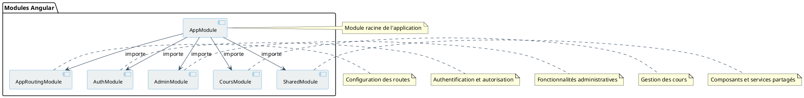

# Diagramme des Modules Angular

## Description du diagramme

Ce diagramme illustre l'organisation modulaire de l'application Angular, montrant comment les différents modules s'articulent autour du module principal (AppModule). Cette architecture modulaire permet une meilleure séparation des préoccupations et une maintenance plus facile du code.
