# Diagramme de Routage Angular

```plantuml
@startuml Routing_Angular

' Style du diagramme
skinparam componentStyle uml2
skinparam component {
  BorderColor #3498db
  BackgroundColor #ecf0f1
  ArrowColor #34495e
  FontName Arial
  FontSize 12
}

package "Structure de Routage Angular" {
  [AppRoutingModule] as routing

  ' Routes principales
  component "Routes" {
    [/] as root #lightgreen
    [/login] as login
    [/home] as home
    [/dashboard] as dashboard
    [/mes-cours] as mes_cours
    [/recherche-cours] as recherche
    [/cours/:id] as cours_detail
    [/admin] as admin
  }

  ' Routes enfants - Administration
  component "Routes Administration" {
    [/admin/users] as admin_users
    [/admin/users/create] as create_user
    [/admin/users/edit/:id] as edit_user
    [/admin/ues] as admin_ues
    [/admin/ues/create] as create_ue
    [/admin/ues/edit/:id] as edit_ue
    [/admin/logs] as admin_logs
    [/admin/assign] as assign_ue_user
  }

  ' Routes enfants - Cours
  component "Routes Cours" {
    [/cours/:id/content/:contentId] as content
    [/cours/:id/forum] as forum
    [/cours/:id/files] as files
    [/cours/:id/notes] as notes
  }

  ' Composants liés aux routes
  [LoginComponent] as login_comp
  [HomeComponent] as home_comp
  [TableauDeBordComponent] as dashboard_comp
  [MesCoursComponent] as mes_cours_comp
  [RechercheCourComponent] as recherche_comp
  [UnCoursComponent] as cours_detail_comp
  [AdminPageComponent] as admin_comp
  [UserListComponent] as admin_users_comp
  [CreateUserComponent] as create_user_comp
  [EditUserComponent] as edit_user_comp
  [UeListComponent] as admin_ues_comp
  [CreateUeComponent] as create_ue_comp
  [EditUeComponent] as edit_ue_comp
  [LogsListComponent] as admin_logs_comp
  [AssignUeUserComponent] as assign_ue_user_comp
  [ContentComponent] as content_comp
  [PostComponent] as forum_comp
  [FileComponent] as files_comp
  [GradePopupComponent] as notes_comp

  ' Relations Routes -> Composants
  login --> login_comp
  home --> home_comp
  dashboard --> dashboard_comp
  mes_cours --> mes_cours_comp
  recherche --> recherche_comp
  cours_detail --> cours_detail_comp
  admin --> admin_comp
  
  admin_users --> admin_users_comp
  create_user --> create_user_comp
  edit_user --> edit_user_comp
  admin_ues --> admin_ues_comp
  create_ue --> create_ue_comp
  edit_ue --> edit_ue_comp
  admin_logs --> admin_logs_comp
  assign_ue_user --> assign_ue_user_comp

  content --> content_comp
  forum --> forum_comp
  files --> files_comp
  notes --> notes_comp

  ' Structure de navigation
  routing --> root
  root --> home
  root --> login
  root --> dashboard
  root --> mes_cours
  root --> recherche
  root --> cours_detail
  root --> admin
  
  admin --> admin_users
  admin_users --> create_user
  admin_users --> edit_user
  admin --> admin_ues
  admin_ues --> create_ue
  admin_ues --> edit_ue
  admin --> admin_logs
  admin --> assign_ue_user

  cours_detail --> content
  cours_detail --> forum
  cours_detail --> files
  cours_detail --> notes

  ' Guards de route
  [AuthGuard] as auth_guard
  [AdminGuard] as admin_guard
  [TeacherGuard] as teacher_guard

  ' Relations Guards -> Routes
  auth_guard --> dashboard
  auth_guard --> mes_cours
  auth_guard --> recherche
  auth_guard --> cours_detail
  auth_guard --> admin
  
  admin_guard --> admin
  admin_guard --> admin_users
  admin_guard --> admin_ues
  admin_guard --> admin_logs
  
  teacher_guard --> content

  note bottom of auth_guard : Protection des routes authentifiées
  note bottom of admin_guard : Protection des routes administratives
  note bottom of teacher_guard : Protection des fonctionnalités enseignantes

}

@enduml
```

## Description du diagramme

Ce diagramme illustre la structure de routage de l'application Angular, montrant comment les différentes URL sont associées aux composants correspondants.

Le diagramme met en évidence :
- La hiérarchie des routes (routes principales et routes enfants)
- Les relations entre les routes et les composants Angular qui y sont associés
- Les guards de sécurité qui protègent certaines routes
- La navigation entre les différentes sections de l'application

Cette structure de routage définit la navigation dans l'application et contribue à organiser les différentes fonctionnalités de manière cohérente pour l'utilisateur.
