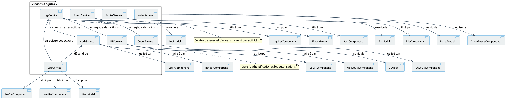

# Diagramme des Services Angular

## Description du diagramme

Ce diagramme montre l'architecture des services Angular dans l'application et leurs interactions. Les services sont des éléments centraux de l'architecture Angular, fournissant des fonctionnalités partagées et un moyen d'encapsuler la logique métier.

Le diagramme met en évidence :
- Les différents services de l'application
- Les relations entre les services et les composants qui les utilisent
- Les relations entre les services et les modèles de données qu'ils manipulent
- Les dépendances entre les différents services
