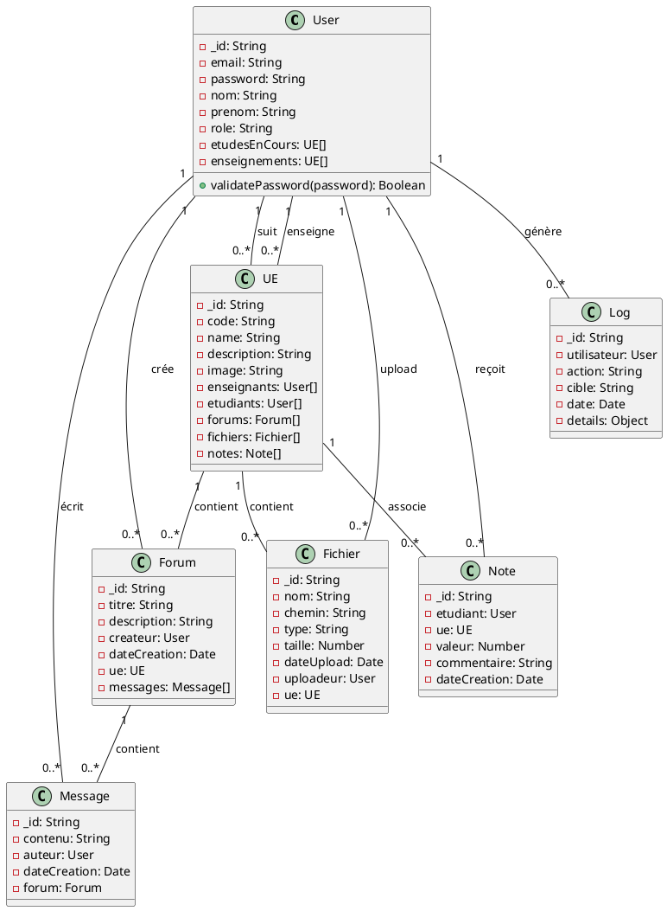
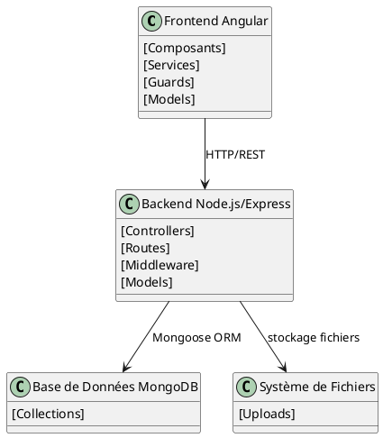
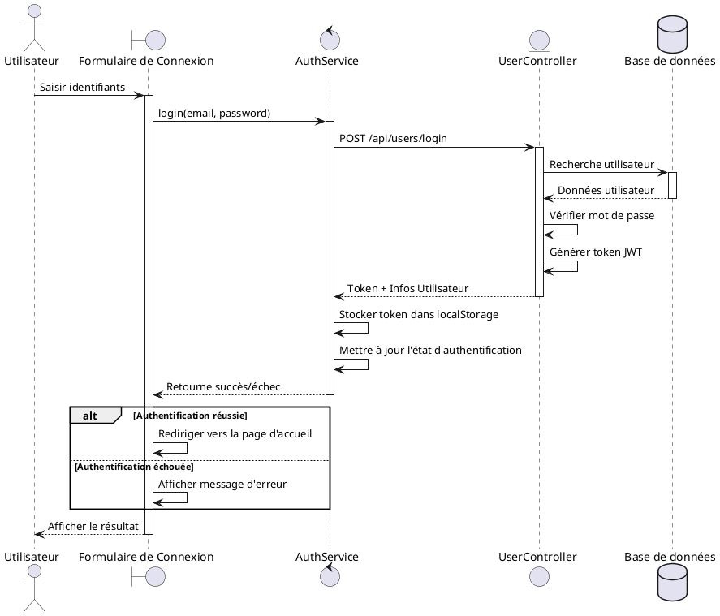
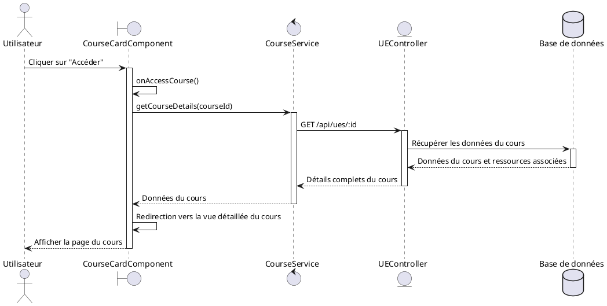
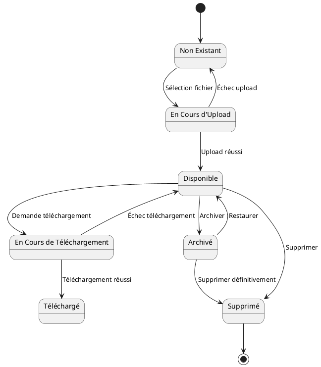
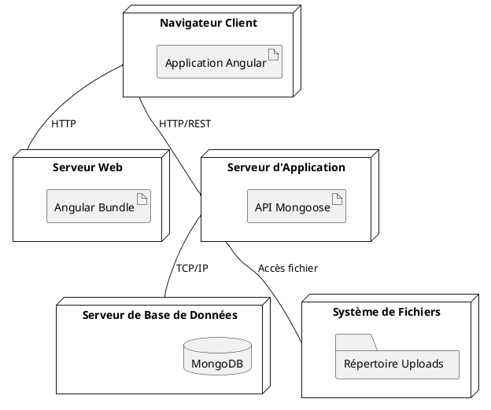
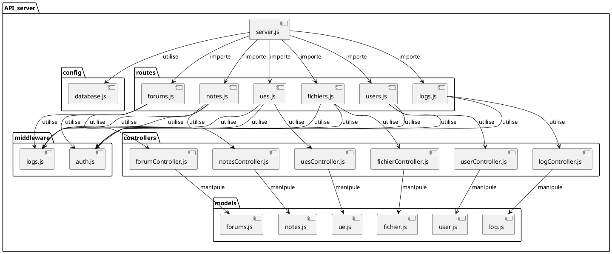
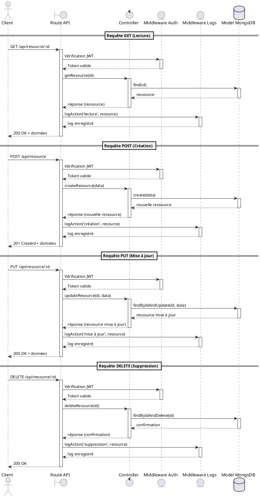
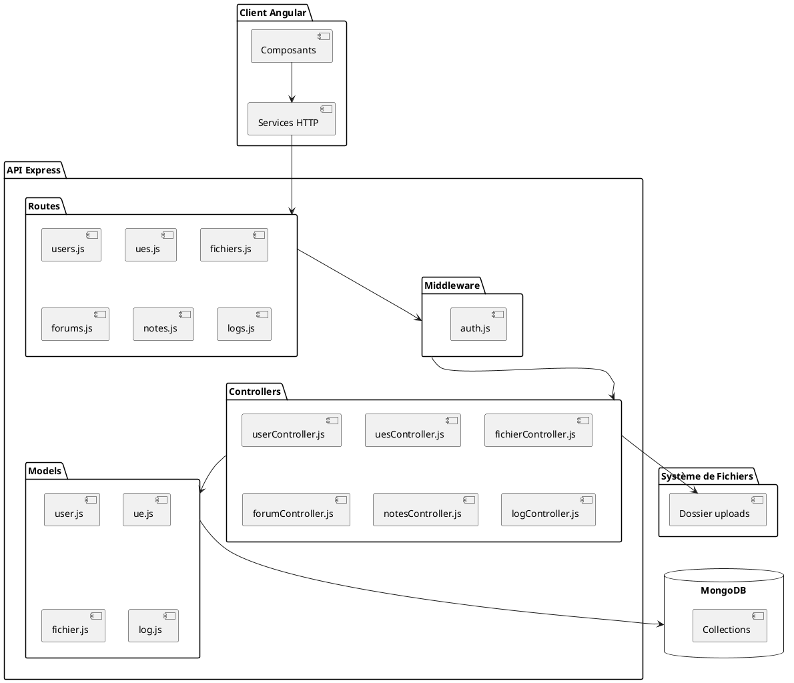

# Diagrammes UML du Projet WE4A-SI40

Ce document contient les diagrammes UML essentiels pour comprendre la structure et le fonctionnement du système.

## Diagramme de Classes

Ce diagramme illustre la structure des entités principales du système et leurs relations. Il représente le modèle de données utilisé à la fois par le frontend Angular et le backend Express.

**Explication :** 
Ce diagramme montre les principales classes (entités) du système et leurs attributs. Les relations entre les classes sont également représentées, comme les relations entre les utilisateurs (User) et les unités d'enseignement (UE), ou entre les forums et les messages. Les cardinalités (1, 0..*) indiquent le nombre d'instances qui peuvent être liées entre les classes.

## Diagramme d'Architecture

Ce diagramme présente une vue globale de l'architecture du système, montrant les principales couches et leurs interactions.

**Explication :**
Ce diagramme illustre l'architecture globale du système, divisée en trois couches principales :
1. **Frontend Angular** : Contient les composants, services, guards et modèles de l'application cliente
2. **Backend Node.js/Express** : Gère les requêtes API, les contrôleurs, les routes et les modèles de données
3. **Base de Données MongoDB** : Stocke les données de l'application
4. **Système de Fichiers** : Gère le stockage physique des fichiers uploadés

Les flèches indiquent les flux de communication entre ces couches (HTTP/REST, Mongoose ORM, accès fichiers).

## Diagramme de Cas d'Utilisation

Ce diagramme identifie les différents acteurs du système et les fonctionnalités auxquelles ils ont accès.

```plantuml
@startuml Cas d'utilisation

:Étudiant: as Student
:Enseignant: as Teacher
:Administrateur: as Admin

rectangle "Plateforme d'Apprentissage" {
  (S'authentifier) as Login
  (Consulter les cours) as ViewCourses
  (Participer aux forums) as ForumParticipation
  (Télécharger des documents) as DownloadDocs
  (Consulter ses notes) as ViewGrades
  
  (Créer un cours) as CreateCourse
  (Gérer les contenus de cours) as ManageCourse
  (Déposer des documents) as UploadDocs
  (Noter les étudiants) as GradeStudents
  (Créer des forums) as CreateForum
  
  (Gérer les utilisateurs) as ManageUsers
  (Gérer tous les cours) as ManageAllCourses
  (Consulter les logs) as ViewLogs
}

Student --> Login
Student --> ViewCourses
Student --> ForumParticipation
Student --> DownloadDocs
Student --> ViewGrades

Teacher --> Login
Teacher --> ViewCourses
Teacher --> CreateCourse
Teacher --> ManageCourse
Teacher --> UploadDocs
Teacher --> GradeStudents
Teacher --> CreateForum
Teacher --> ForumParticipation

Admin --> Login
Admin --> ManageUsers
Admin --> ManageAllCourses
Admin --> ViewLogs

@enduml
```

**Explication :**
Ce diagramme de cas d'utilisation montre les trois types d'utilisateurs du système (Étudiant, Enseignant et Administrateur) et les actions qu'ils peuvent effectuer. Chaque utilisateur a des permissions différentes :
- **Étudiant** : Peut consulter les cours, participer aux forums, télécharger des documents et consulter ses notes
- **Enseignant** : Possède toutes les permissions des étudiants, plus la capacité de créer et gérer des cours, déposer des documents, noter les étudiants et créer des forums
- **Administrateur** : Peut gérer les utilisateurs, gérer tous les cours et consulter les logs du système

## Diagramme de Séquence - Processus d'Authentification

Ce diagramme montre les interactions entre les différents composants lors de l'authentification d'un utilisateur.

**Explication :**
Ce diagramme de séquence détaille le processus d'authentification d'un utilisateur :
1. L'utilisateur saisit ses identifiants dans le formulaire de connexion
2. Le AuthService envoie ces informations au backend via une requête POST
3. Le contrôleur recherche l'utilisateur dans la base de données, vérifie le mot de passe et génère un token JWT
4. Le token et les informations utilisateur sont renvoyés au service d'authentification qui les stocke dans le localStorage
5. Selon le résultat, l'utilisateur est redirigé vers la page d'accueil ou un message d'erreur est affiché

## Diagramme de Séquence - Accès à un Cours

Ce diagramme illustre le processus d'accès à un cours spécifique par un utilisateur.

**Explication :**
Ce diagramme montre comment un utilisateur accède aux détails d'un cours :
1. L'utilisateur clique sur "Accéder" dans la carte d'un cours
2. Le composant de carte de cours demande les détails du cours au service correspondant
3. Le service envoie une requête GET à l'API pour obtenir les données complètes du cours
4. Les données sont récupérées de la base de données et renvoyées au frontend
5. L'utilisateur est redirigé vers la vue détaillée du cours avec toutes les informations chargées

## Diagramme d'État - Cycle de Vie d'un Fichier

Ce diagramme présente les différents états possibles d'un fichier dans le système et les transitions entre ces états.

**Explication :**
Ce diagramme d'état montre le cycle de vie complet d'un fichier dans le système :
1. Le fichier commence à l'état "Non Existant" (avant d'être ajouté au système)
2. Lors de la sélection d'un fichier pour l'upload, il passe à l'état "En Cours d'Upload"
3. Si l'upload réussit, il passe à l'état "Disponible", sinon il revient à "Non Existant"
4. Un fichier disponible peut être téléchargé (passant par l'état "En Cours de Téléchargement" puis "Téléchargé")
5. Un fichier disponible peut également être archivé pour un stockage à long terme
6. Les fichiers disponibles ou archivés peuvent être supprimés
7. La suppression d'un fichier termine son cycle de vie dans le système

Cette modélisation reflète plus précisément la gestion des fichiers dans l'application, avec les états correspondant aux manipulations possibles dans l'interface utilisateur et l'API.

## Diagramme de Déploiement

Ce diagramme illustre l'infrastructure physique sur laquelle le système est déployé.

**Explication :**
Ce diagramme de déploiement montre l'architecture d'hébergement de l'application :
1. **Navigateur Client** : Exécute l'application Angular compilée
2. **Serveur Web** : Héberge le bundle Angular optimisé pour la production
3. **Serveur d'Application** : Fait tourner l'API Express.js qui gère la logique métier
4. **Serveur de Base de Données** : Héberge MongoDB pour le stockage des données
5. **Système de Fichiers** : Stocke les fichiers uploadés dans un répertoire dédié

Les connexions entre ces nœuds sont également spécifiées (HTTPS, REST, TCP/IP, accès fichier).

## Diagramme de Structure de l'API

Ce diagramme détaille l'organisation interne de l'API Express, montrant les relations entre les différents fichiers et modules.

**Explication :**
Ce diagramme présente la structure détaillée de l'API Express.js :
1. **server.js** : Point d'entrée de l'API qui configure et lance le serveur
2. **config** : Contient les configurations comme la connexion à la base de données
3. **middleware** : Fonctions intermédiaires pour l'authentification et la journalisation
4. **controllers** : Contient la logique métier pour chaque type de ressource
5. **models** : Définit les schémas et modèles Mongoose pour interagir avec MongoDB
6. **routes** : Définit les endpoints API et associe les requêtes HTTP aux contrôleurs

Les flèches montrent comment ces composants sont liés (imports, utilisations, manipulations).

## Diagramme de Séquence - Opération CRUD API

Ce diagramme montre les interactions lors des opérations CRUD (Create, Read, Update, Delete) sur l'API.

**Explication :**
Ce diagramme de séquence détaille les quatre opérations CRUD fondamentales de l'API :
1. **GET (Lecture)** : Récupération d'une ressource avec vérification du token JWT et journalisation
2. **POST (Création)** : Création d'une nouvelle ressource avec vérification d'authentification
3. **PUT (Mise à jour)** : Modification d'une ressource existante avec contrôle d'accès
4. **DELETE (Suppression)** : Suppression d'une ressource avec journalisation de l'action

Pour chaque opération, le diagramme montre le flux complet depuis le client jusqu'à la base de données, y compris les vérifications de sécurité et la journalisation.

## Diagramme de Flux de Données - API

Ce diagramme illustre comment les données circulent à travers les différentes couches de l'API.

**Explication :**
Ce diagramme de flux de données montre comment l'information circule dans le système :
1. Les composants Angular interagissent avec les services HTTP du frontend
2. Ces services envoient des requêtes aux routes de l'API Express
3. Les requêtes passent par les middleware d'authentification et de journalisation
4. Les contrôleurs traitent les requêtes et interagissent avec les modèles
5. Les modèles communiquent avec la base de données MongoDB
6. Les contrôleurs peuvent également interagir directement avec le système de fichiers pour gérer les uploads

Cette structure en couches permet une séparation claire des responsabilités dans l'application.

## Notes d'Utilisation

Ces diagrammes UML peuvent être visualisés avec des outils comme:
- [PlantUML](https://plantuml.com/)
- [Visual Studio Code avec l'extension PlantUML](https://marketplace.visualstudio.com/items?itemName=jebbs.plantuml)
- [Online PlantUML Editor](https://www.planttext.com/)

Pour mettre à jour ces diagrammes, modifiez le code PlantUML correspondant et régénérez l'image.
